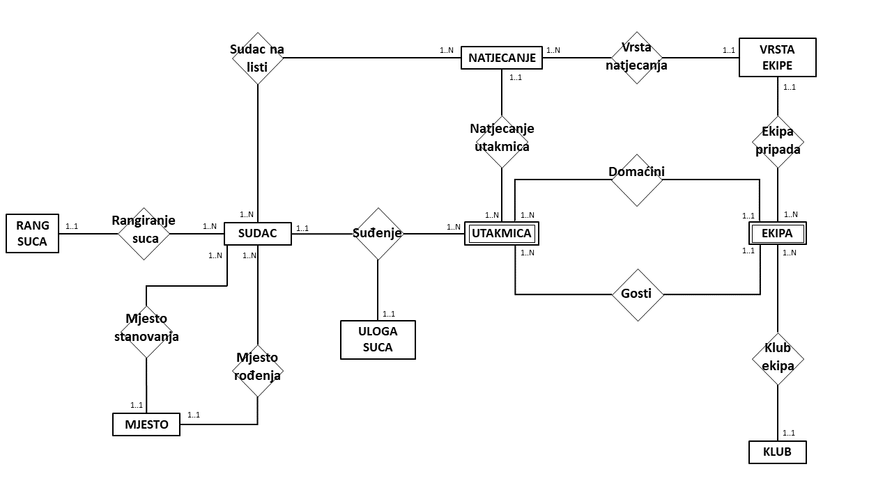

# up_lab

## Upute za korištenje:
1. Napraviti novog korisnika u Oracle bazi.
2. Drag&drop skripte *create_tables.sql* u SQL developer i pokrenuti ju.
3. Isto napraviti za *insert_data.sql*.
4. Ako želimo prepraviti model, prvo obrišemo sve tablice sa *drop_all.sql*.
5. Ako želimo obrisati sadržaj svih tablica, ali ne i same tablice, pokrenemo *delete_all_rows.sql*.
6. Dodatna ograničenja omogućiti pokretanjem skripti *uvjet_ekipa_natjecanje.sql* i *uvjet_sudac_utakmica.sql*

## ER model:

